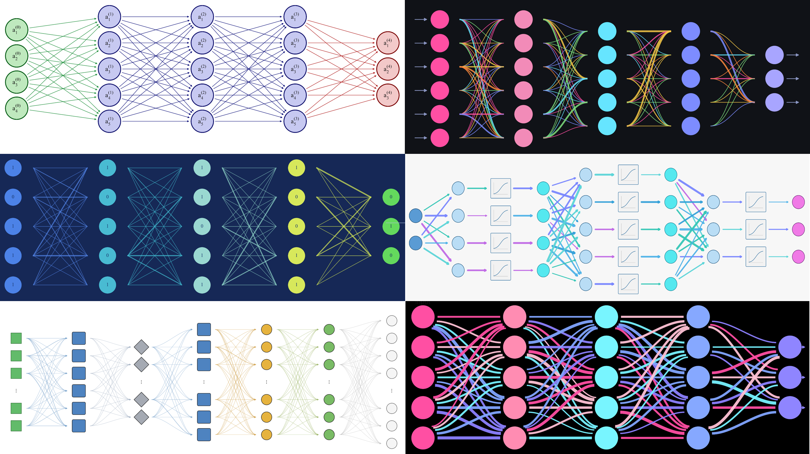
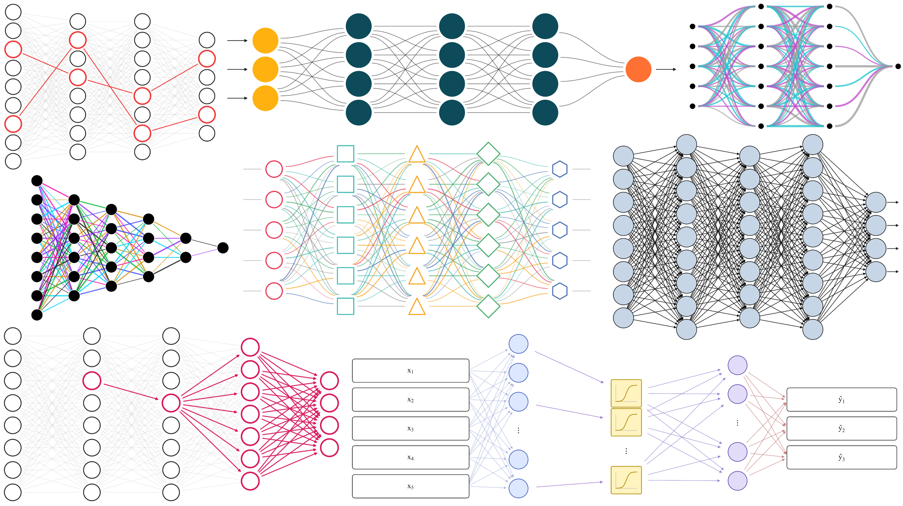
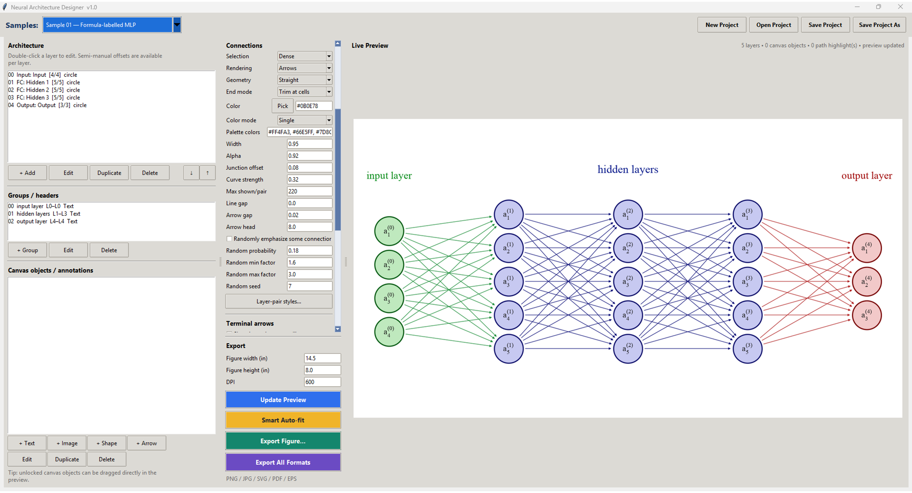

# Neural Architecture Designer

**Version 1.0**

[](https://doi.org/10.5281/zenodo.22135298)
[](https://doi.org/10.5281/zenodo.22135398)

Neural Architecture Designer is a desktop application for creating editable, publication-ready neural-network architecture diagrams with Python, Tkinter, Matplotlib, and Pillow.

## Gallery

### Neural network architecture diagram examples



### Neural network visualization and path highlighting examples



### Neural Architecture Designer interface



A search-oriented public gallery is included in [`docs/index.html`](docs/index.html), with descriptive image metadata and an image sitemap for web indexing.

## Features

- Editable network layers and node counts
- Circle, square, ellipse, rounded, diamond, triangle, hexagon, pentagon, and activation-block styles
- Dense, sampled, adjacent-only, or disabled layer-pair connectivity
- Straight and curved-horizontal connections
- Lines and directional arrows
- Surface-aware connection gaps
- Outside-junction positioning with positive or negative offset
- Single, palette-cycle, and random-palette connection colors
- Randomized connection widths
- Per-layer-pair connection overrides
- Path and cascade highlighting
- Text, image, arrow, line, divider, and shape annotations
- Input/output item boxes
- Built-in editable Samples
- Resizable three-column workspace
- Scrollable Style & Connections panel with a fixed Export panel
- PNG, JPG, SVG, PDF, and EPS export
- Editable project save/load

## Windows quick start

1. Install **Python 3.10+**.
2. Download or clone the repository.
3. Double-click **`RUN_APP.bat`**.
4. On the first launch, the script creates a local `.venv` and installs the required packages.
5. Choose an architecture from the blue **Samples** selector.
6. Edit the project and export the finished figure from the Export panel.

## Run manually

```bash
python -m venv .venv
.venv\Scripts\activate
pip install -r requirements.txt
python neural_architecture_designer.py
```

## Build the Windows executable

Double-click **`BUILD_EXE.bat`**. The builder checks and bundles the Matplotlib backends required by PNG, JPG, SVG, PDF, and EPS export. The resulting executable is placed in the project root:

```text
NeuralArchitectureDesigner.exe
```

## Project controls

- **New Project**
- **Open Project**
- **Save Project**
- **Save Project As**

Figure export is available separately in the Export panel.

## Documentation

- `QUICK_START.txt` — minimal setup instructions
- `USER_GUIDE.md` — practical usage guide
- `RELEASE_NOTES.md` — v1.0 release summary
- `CHANGELOG.md` — version history

## Requirements

- Python 3.10+
- Matplotlib 3.8+
- Pillow 10+
- Tkinter

## Publication and citation

**Scientific article:**  
https://doi.org/10.5281/zenodo.22135398

**Archived software release:**  
https://doi.org/10.5281/zenodo.22135298

For academic use, see `CITATION.cff`.

## License

**MIT License**

Copyright (c) 2026 Mohammad Azhdari

Permission is hereby granted, free of charge, to any person obtaining a copy of this software and associated documentation files (the "Software"), to deal in the Software without restriction, including without limitation the rights to use, copy, modify, merge, publish, distribute, sublicense, and/or sell copies of the Software, and to permit persons to whom the Software is furnished to do so, subject to the following conditions:

The above copyright notice and this permission notice shall be included in all copies or substantial portions of the Software.

THE SOFTWARE IS PROVIDED "AS IS", WITHOUT WARRANTY OF ANY KIND, EXPRESS OR IMPLIED, INCLUDING BUT NOT LIMITED TO THE WARRANTIES OF MERCHANTABILITY, FITNESS FOR A PARTICULAR PURPOSE AND NONINFRINGEMENT. IN NO EVENT SHALL THE AUTHORS OR COPYRIGHT HOLDERS BE LIABLE FOR ANY CLAIM, DAMAGES OR OTHER LIABILITY, WHETHER IN AN ACTION OF CONTRACT, TORT OR OTHERWISE, ARISING FROM, OUT OF OR IN CONNECTION WITH THE SOFTWARE OR THE USE OR OTHER DEALINGS IN THE SOFTWARE.
